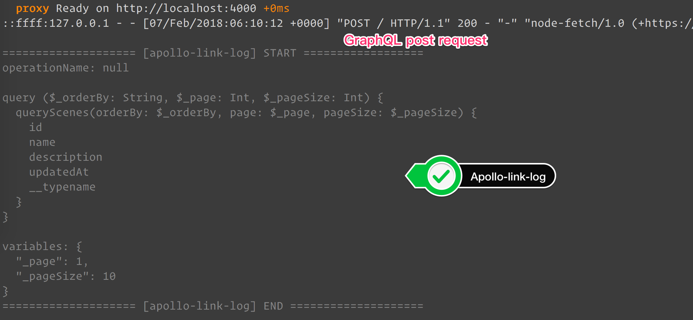

# apollo-link-log

> Log side effect for Apollo Link.

[![Travis][build-badge]][build]
[![Codecov Status][codecov-badge]][codecov]
[![npm package][npm-badge]][npm]
[![npm downloads][npm-downloads]][npm]

[![Dependency Status][dependency-badge]][dependency]
[![devDependency Status][devdependency-badge]][devdependency]
[![peerDependency Status][peerdependency-badge]][peerdependency]

[![prettier][prettier-badge]][prettier]
[![license][license-badge]][license]

## Installation

```sh
$ yarn add apollo-link-log apollo-link graphql
```

## Usage

```js
import createLogLink from 'apollo-link-log';

// Default
ApolloLink.concat(createLogLink());

// With options
ApolloLink.concat(createLogLink({
  enabled: process.env.NODE_ENV !== 'production',
  logger: ({ operation, operationName, query, variables }) => {...};
}));
```

## Snapshot



## Options

```js
type Options = {
  enabled?: boolean,
  logger?: (params: {
    operation: Object,
    operationName: ?string,
    query: string,
    variables: Object,
  }) => void,
};
```

## Inspiration

* https://github.com/blackxored/apollo-link-logger

## Development

### Requirements

* node >= 9.5.0
* yarn >= 1.3.2
* apollo-link ^1.0.0
* graphql ^0.13.0

```sh
$ yarn install --pure-lockfile
$ yarn start
```

## Test

```sh
$ yarn run format
$ yarn run eslint
$ yarn run flow
$ yarn run test:watch
$ yarn run build
```

---

## CONTRIBUTING

* ⇄ Pull requests and ★ Stars are always welcome.
* For bugs and feature requests, please create an issue.
* Pull requests must be accompanied by passing automated tests.

## [CHANGELOG](CHANGELOG.md)

## [LICENSE](LICENSE)

MIT: [http://michaelhsu.mit-license.org](http://michaelhsu.mit-license.org)

[build-badge]: https://img.shields.io/travis/evenchange4/apollo-link-log/master.svg?style=flat-square
[build]: https://travis-ci.org/evenchange4/apollo-link-log
[npm-badge]: https://img.shields.io/npm/v/apollo-link-log.svg?style=flat-square
[npm]: https://www.npmjs.org/package/apollo-link-log
[codecov-badge]: https://img.shields.io/codecov/c/github/evenchange4/apollo-link-log.svg?style=flat-square
[codecov]: https://codecov.io/github/evenchange4/apollo-link-log?branch=master
[npm-downloads]: https://img.shields.io/npm/dt/apollo-link-log.svg?style=flat-square
[license-badge]: https://img.shields.io/npm/l/apollo-link-log.svg?style=flat-square
[license]: http://michaelhsu.mit-license.org/
[dependency-badge]: https://david-dm.org/evenchange4/apollo-link-log.svg?style=flat-square
[dependency]: https://david-dm.org/evenchange4/apollo-link-log
[devdependency-badge]: https://david-dm.org/evenchange4/apollo-link-log/dev-status.svg?style=flat-square
[devdependency]: https://david-dm.org/evenchange4/apollo-link-log#info=devDependencies
[peerdependency-badge]: https://david-dm.org/evenchange4/apollo-link-log/peer-status.svg?style=flat-square
[peerdependency]: https://david-dm.org/evenchange4/apollo-link-log#info=peerDependencies
[prettier-badge]: https://img.shields.io/badge/styled_with-prettier-ff69b4.svg?style=flat-square
[prettier]: https://github.com/prettier/prettier
